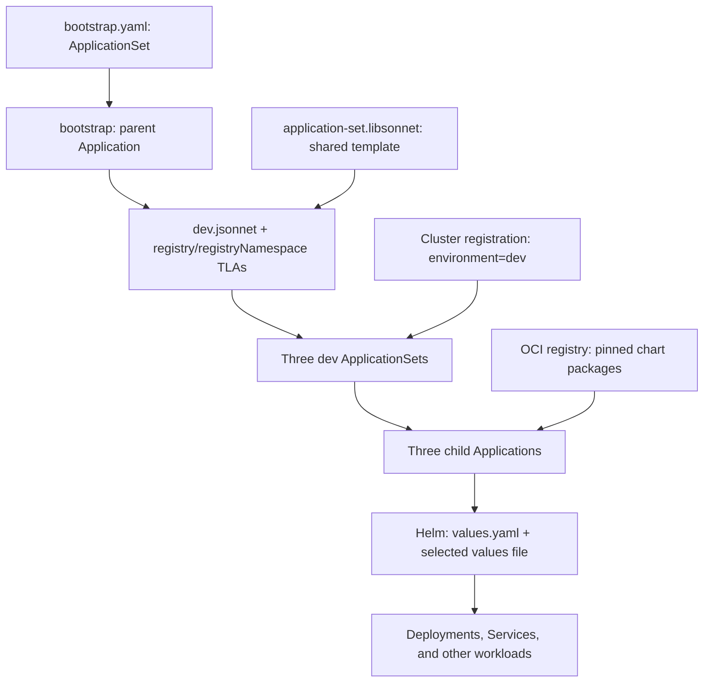

# Argo CD bootstrap and parameter examples

A disposable kind cluster runs Argo CD, a local Git server pod, and this hierarchy:

```text
bootstrap (ApplicationSet → parent Application)
├── dev-child-one (ApplicationSet → Application → OCI podinfo chart)
├── dev-child-two (ApplicationSet → Application → OCI podinfo chart)
└── dev-child-three (ApplicationSet → Application → OCI podinfo chart)
```

All children target the local cluster. The parent points at one Git directory
containing multiple child ApplicationSets and manages no workloads itself.
The Git hostname is supplied at runtime, not committed into source manifests.

## Prerequisites

- Nix with flakes enabled.
- A running Docker daemon, accessible without sudo.
- Internet access for Nix packages, images, Argo CD manifests, and Alpine packages.
- Roughly 4 CPUs / 6 GiB RAM available for the cluster and Argo CD.

The development shell provides kind, kubectl, Helm, Argo CD CLI, Jsonnet, Docker
client, make, and validation tools. On macOS it includes Colima; cluster startup
starts Colima if Docker is unavailable. Docker Desktop also works.

## Run

```bash
nix develop
make test
make ui
```

The UI is **https://localhost:18080**. Accept the self-signed certificate.
`make ui` prints the current admin password and forwards the UI until Ctrl+C.
Open Application **bootstrap** to see the three child ApplicationSets. Open
**dev-child-one**, **dev-child-two**, or **dev-child-three** to see their workloads.

The plain YAML bootstrap loads only `examples/application-sets/dev.jsonnet`.
That file returns three ApplicationSets using one shared
`application-set.libsonnet` template and independently pinned release versions.
`staging.jsonnet`, `prod.jsonnet`, and `demo.jsonnet` remain undeployed examples.
`registry` and `registryNamespace` are the TLAs for the OCI host and repository path. `ENVIRONMENT` controls names and cluster targeting;
`ENVIRONMENT_VALUES` selects a filename inside the chart package. For example, demo
can use dev settings without becoming a dev deployment.
See [`examples/bootstrap/README.md`](examples/bootstrap/README.md) for details
and deployment against your own Git host.

## How rendering works

There are three rendering steps, each with a different job:

1. **Jsonnet creates ApplicationSets.** The bootstrap Application reads
   `dev.jsonnet`, passes in `registry` and `registryNamespace`, and imports
   `application-set.libsonnet`. The result is an array of three ApplicationSets.
2. **ApplicationSet creates Applications.** Each child selects the dev cluster.
   The controller fills in generator values such as `{{.server}}` and `{{.name}}`.
3. **Helm creates workload manifests.** Each Application downloads its pinned OCI
   chart, merges the chart values and overrides, and renders Kubernetes resources.

The bootstrap manages only the child ApplicationSets—not the workloads directly.
Only `dev.jsonnet` is selected; staging and prod are examples, not deployed.



### Environment files: `dev.jsonnet` versus chart `dev.yaml`

These files serve different purposes:

| File | Purpose |
| --- | --- |
| `examples/application-sets/dev.jsonnet` | Lists dev releases and their chart/version pins. |
| `staging.jsonnet` / `prod.jsonnet` | Independent release lists for later environments. |
| `demo.jsonnet` | Demo environment identity with the dev values profile. |
| Chart `values.yaml` | Packaged defaults: image version, resources, replicas, and other settings. |
| Chart `dev.yaml`, `staging.yaml`, etc. | Optional packaged overrides for that environment. |

Each release list defines identity and the values filename separately:

```jsonnet
local ENVIRONMENT = 'demo';
local ENVIRONMENT_VALUES = 'dev.yaml';
```

This creates `demo-*` resources and targets demo clusters, but loads the chart's
`dev.yaml`. The generic helper takes both arguments independently:

```jsonnet
applicationSet(registry, registryNamespace, environment, environmentValues, release)
```

Its Helm configuration selects the exact filename, without inferring it from
the environment name:

```jsonnet
helm: {
  releaseName: APP_NAME,
  valueFiles: [environmentValues],
},
```

Neither argument is injected into `.Values`: `environment` is for resource names
and cluster selection, while `environmentValues` is for file selection.
Helm **automatically loads chart `values.yaml`**, then applies the selected file.
For demo selecting dev settings, that means **`values.yaml` → `dev.yaml`**.
Inline values and parameters, if added later, take precedence over these files.

The selected file must exist inside that version of the chart package. A file
next to `dev.jsonnet` in Git is not automatically available to an OCI chart.
Missing files fail rendering; the demo does not silently ignore them.

The runnable dev example selects **`values.yaml`**, because public podinfo does
not package `dev.yaml`. This reapplies the chart's defaults without overrides.
The undeployed demo/staging/prod examples illustrate `dev.yaml`, `staging.yaml`,
and `prod.yaml`; replace their chart pins with your own chart that contains those
files before deploying them. No local registry or repackaging is required.
Changing settings inside a packaged file requires publishing a new chart version.

### Where versions change and how promotion works

Edit the release entry in the relevant environment file—not the shared template
or bootstrap:

```jsonnet
// examples/application-sets/dev.jsonnet
{ name: 'child-one', chart: 'podinfo', version: '6.9.2' },
```

To promote that release, update only its corresponding version in
`examples/application-sets/staging.jsonnet`, then later in `prod.jsonnet`.
Other releases and environments keep their existing pins. Reuse of the template
is unaffected by different versions.

`version` selects the **chart package version**. Image versions and deployment
settings remain in that package. Use the exact published chart version; don't
add a `v` prefix unless it is part of the published version.

For this local demo, run `make bootstrap` after editing dev to refresh the Git
snapshot. Tests currently expect podinfo 6.9.2; update their expected chart/image
version in `examples/bootstrap/test.sh` and HTTP version in
`scripts/bootstrap.sh` if you change that demo pin. Staging/prod are not tested
or deployed until you deliberately configure their bootstrap selection and
matching cluster registrations.

## What the test proves

1. Creates or reuses the `argocd-parameters` cluster with `.state/kubeconfig`.
2. Installs Argo CD and waits for controllers and the API.
3. Renders only dev, pulls podinfo 6.9.2, and verifies packaged chart defaults.
4. Copies the local example files into a mounted archive. A Git server pod's
   init container commits them into a disposable bare repository.
5. Deploys ApplicationSet **bootstrap**, whose Application fetches one directory
   and creates **dev-child-one**, **dev-child-two**, and **dev-child-three**.
6. Waits for the parent to sync to the current Git revision and for each child to
   deploy the OCI chart version, then checks all three HTTP greetings.

Expected live assertion:

```text
PASS: bootstrap -> dev-child-one, dev-child-two, dev-child-three -> OCI chart defaults; staging/prod not deployed
```

No external Git publication or chart push is needed. The demo downloads the
existing public OCI chart and podinfo container images from GHCR. Only public example files are
copied into the Git pod, never kubeconfigs or CLI credentials. Rerun
`make bootstrap` after changing local files to refresh the repository snapshot.

## Other targets

```bash
make bootstrap # Refresh/test bootstrap on an existing demo cluster
make ui        # Print credentials and forward the UI
make lint      # ShellCheck, shfmt, Jsonnet and OCI Helm rendering tests
make cluster   # Create/export the kind cluster
make install   # Create cluster and install Argo CD
make clean     # Delete the demo cluster
```

Use `make ui ARGOCD_PORT=28080` if port 18080 is occupied.
Stop the UI before `make clean`. Cleaning deletes the cluster, not `.state`;
a fresh cluster has a new admin password.

## Local setup and safety

On macOS, start Colima manually if needed:

```bash
colima start --runtime docker --cpu 4 --memory 6 --disk 30
docker context use colima
```

Or use direnv with nix-direnv and run `direnv allow`; `.envrc` uses `use flake`.
Installing direnv in the dev shell does not install your host shell hook.

This is not a production configuration: it uses the initial admin credential,
self-signed TLS, and an unauthenticated read-only Git protocol server inside the
cluster. Port forwards bind only localhost. `.state` is ignored and restricted;
do not publish it. `make clean` preserves local evidence and credentials.
